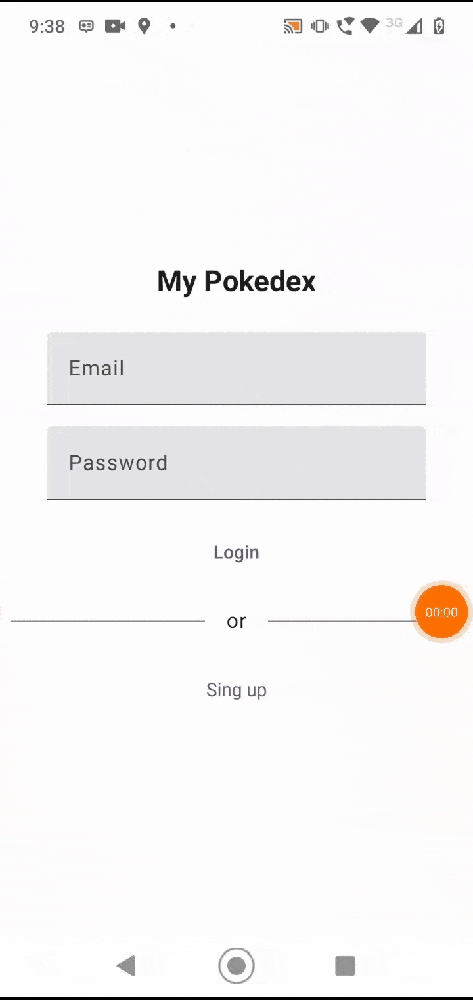
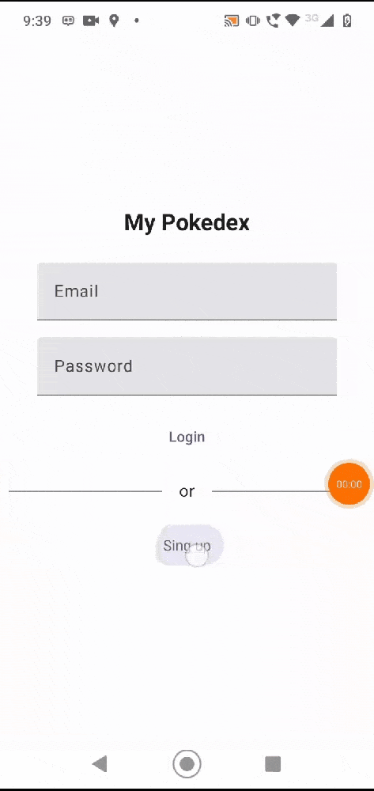
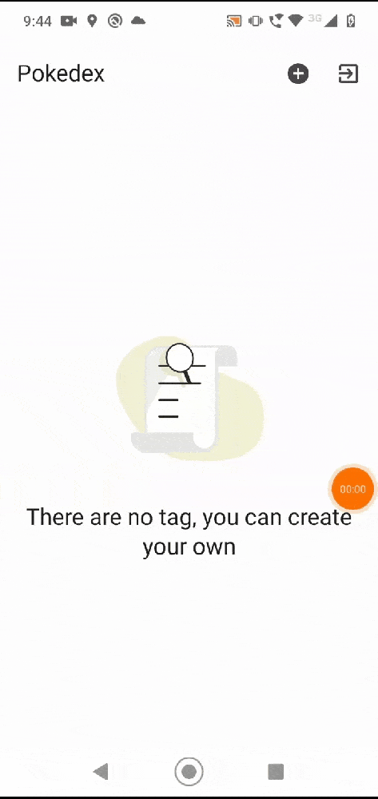
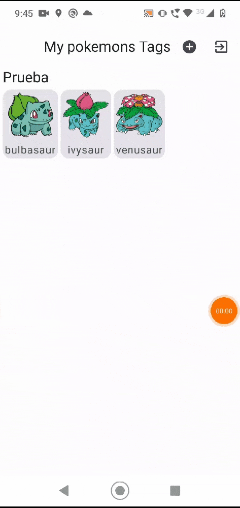

# My Pokedex 
Este aplicativo, cuenta con las mejores prácticas y herramientas de desarrollo, además las tecnologías más populares del desarrollo mobile en Android.

## Información general

El proyecto costan en permitir al usuario crear multiples categorias, Listar, Eliminar y visualizarlas. Para agregar items a esa cateogira se usa el api [PokéApi](https://pokeapi.co/), puedes seleccionar multiples pokemons y crear una categoria con ellas.


### Requerimientos

* Versión de Android: 14
* Versión de Koltin: 1.9.10
* Versión de Jepack compose: 1.5.3
* Versión Mínima Android SDK: 24
* Versión Android Target SDK: 34
* [API](https://pokeapi.co/) PokéApi


## Funcionalidades
_Puedes hacer lo siguiente en la aplicación_

### Loguearse
La aplicación le permite loguearse, esto usando Firebase Authentication

### Registrarse
La aplicación le permite registrarse, esto usando Firebase Authentication

### Listado de Tag y sus pokemons
La aplicación te mostrara el listado de tags o categorias que el usuario tiene guardadas, con sus repectivos pokemons.

*Nota*: El listado es general, es decir, cualquier usuario podria acceder a esta información (en el desarrollo no relice la opcion de data por usuario)

### Listado de pokemons
La aplicación te mostrara el listado de pokemons, donde el usuario por medio de un LongClick, podra seleccionar N pokemons para poder crear su tag.

*Nota*: Para crear tag se aplicaron reglas de negocio.
- Para crear un tag. Debe de haber al menos un pokemon.
- Para crear un tag. No debe existir otro con el mismo nombre, sin distinguir mayusculas. (Es decir puedo crear un tag a y otro A).

### Intenalización
Los recursos de string estan en dos idiomas, español e ingles, dependiendo de la configuración del dispositivo podra visualizar los mensajes de error y otros.

## Arquitectura
Se propuso como arquitectura para el proyecto una arquitectura limpia usando DDD (enfocada en el modelo de dominio) y en el apartado de aplicación se usa ViewModel para la gestión de estados de UI, asi mismo usando Jetpack Compose para el diseño de UI. 

Se usa el diseño guiado por el dominio ya que provee una estructura de prácticas y terminologías para tomar decisiones de diseño que enfoquen y aceleren el manejo de dominios complejos en los proyectos de software. 


## Estructura del proyecto
En el proyecto se usa la modularización horizontal, la cual nos permitira separar los modulo en función de las capas.
Se identifican los siguementes módulos
* App - Como capa principal.
* Core - Como capa compartida, donde estaran funcion compartidas que necesitamos de manera global en nuestra app.
* Feature - Aqui orquetaremos esas funcionalidades de negocio que requiere nuestra app, como es el Login, 

* Domains Module - Como capa de dominio donde encontramos nuestras reglas de negocio y nuestros servicios 
* Infrastructure Module - Como capa más externa donde encontramos los detalles (Impletaciones de Room, Cliente Http, etc).


## Construido con
### [Retrofit](https://square.github.io/retrofit/) - Cliente HTTP
Como cliente HTTP para el consumo de servicios Rest se usó Retrofit ya que facilita este trabajo en aplicaciones Android y es desarrollada y mantenida por ellos.

Versión: 2.11.0
### [Room](https://developer.android.com/training/data-storage/room?hl=es-419) - Persistencia de datos
Para la base de datos se usó Room ya que es una biblioteca de persistencias que nos brinda una capa de abstracción para SQLite permitiendo acceder a la base de datos fácilmente.

Versión: 2.6.1
### [Hilt](https://developer.android.com/training/dependency-injection/hilt-android?hl=es-419) - Inyección de dependencias
Para realizar la inyección de dependencias se usó la librería por medio de etiquetas.
Y modularización la inyección por sus respectivas capas.

Versión: 2.48
### [Firebase Auth](https://firebase.google.com/docs/auth?hl=es-419) - Firebase Authentication
Para manejar el logueo y registro de los usuarios.

### [Firebase BoM](https://firebase.google.com/docs/android/learn-more?hl=es-419) - Firebase
La BoM (lista de materiales) de Firebase para Android te permite administrar todas las versiones de tus bibliotecas de Firebase con solo especificar una versión, la versión de la BoM.

versión: 33.1.2

### [Mockito Kotlin](https://github.com/mockito/mockito-kotlin) - Mockito
Se uso para realizar las respectivas pruebas unitarias y de integración de la app

Versión: 5.2.1

### [Lottie](https://lottiefiles.com/es/) - Lottie
Para animar el empty state de los estados

Versión: 6.0.1


## Versión

**Version name :** 1.0

## Compilación de la app
* Se recomienda tener JVM 17, instalada y seleccionada en la maquina para la compilarcion.
* Ejecutar las pruebas con el comando 
```bash
  ./gradlew test     
```
## Demo de la aplicación
<p align="center">
   
   
      
            
                
            
</p>

*Nota para eliminar hace un long click sobre el nombre


Kotlin:       1.9.22

Groovy:       3.0.17

Ant:          Apache Ant(TM) version 1.10.13 compiled on January 4 2023

JVM:          17.0.11 (Oracle Corporation 17.0.11+7-LTS-207)

OS:           Mac OS X 14.5 aarch64


